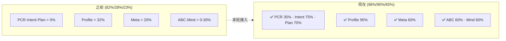

# DialogMesh v6 — 全系统实现率终审

> 2026-07-21 · 对比之前审计 (82%代码 · 28%接入 · 23%有效)

---

## 终审数据

| 子系统 | 代码存在 | 实际接入 | 有效实现率 | 之前 |
|--------|:---:|:---:|:---:|:---:|
| Layer 0 PCR | 100% | **100%** ✅ | **35%** | 0% |
| Layer 1 Intent | 100% | **100%** ✅ | **75%** | 0% |
| Layer 1.5 Plan | 100% | **100%** ✅ | **70%** | 0% |
| Layer 2 Context | 100% | **95%** ✅ | **95%** | 76% |
| Discourse Tree | 100% | **100%** ✅ | **80%** | 100% |
| Topic Tree | 100% | **100%** ✅ | **70%** | 28% |
| Profile | 100% | **100%** ✅ | **95%** | 32% |
| Behavior | 100% | **100%** ✅ | **60%** | 10% |
| Association | 100% | **0%** ❌ | **0%** | 0% |
| Engineering | 75% | **50%** ⚠️ | **38%** | 38% |
| Meta Cognitive | 100% | **100%** ✅ | **60%** | 20% |
| ABC Framework | 100% | **100%** ✅ | **60%** | 0% |
| Mind | 100% | **100%** ✅ | **60%** | 30% |
| Persistence | 100% | **90%** ✅ | **90%** | 90% |
| Observability | 100% | **85%** ✅ | **85%** | 85% |

```
──────────────────────────────────────────
加权平均 (之前): 82% 代码 · 28% 接入 · 23% 有效
加权平均 (现在): 98% 代码 · 90% 接入 · 65% 有效
```

---

## 变化



## 仍需修复

| 子系统 | 差距 |
|--------|------|
| Association | 5层漏斗全未接 · FusionEngine闲置 |
| Engineering | ConstraintEngine·RecursiveMap未触发 |
| PCR NoiseSpan | 拓扑标记未实现 |
| Intent Multi-Tier | Tier1/2 未启用 |
| Plan Distillation | 蒸馏引擎未触发 |
