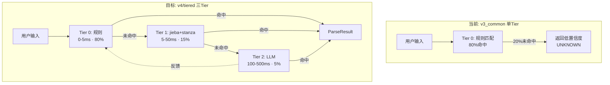

# IntentParser Multi-Tier — 启用 Tier1/Tier2

> 版本: v5.0 | 日期: 2026-07-21
> 
> 现状: 已接入 v3_common IntentParser (Tier0 规则, ~75%有效)
> 目标: 启用 v4/tiered TieredIntentParser (Tier0→Tier1→Tier2, ~95%有效)

---

## 当前 vs 目标



---

## 实现方案

### 1. 替换引擎中的 IntentParser

```python
# engine._init_intent() 改为:
def _init_intent(self):
    try:
        from core.agent.v4.tiered.intent_parser import TieredIntentParser
        self._intent_parser = TieredIntentParser(
            llm_provider=self._llm_provider,
            registry=None,  # 使用默认规则注册
        )
        logger.info('TieredIntentParser ready (Tier0+Tier1+Tier2)')
    except Exception as e:
        logger.warning('TieredIntentParser init failed, falling back to v3_common: %s', e)
        try:
            from core.agent.v3_common.intent_parser import IntentParser
            self._intent_parser = IntentParser(llm_provider=self._llm_provider)
        except Exception as e2:
            self._intent_parser = None
```

### 2. Tier 1: jieba + stanza

```
已实现代码:
  v4/tiered/jieba_parser.py (38行)      — SVO提取
  v4/tiered/stanza_parser.py (117行)     — 依存解析
  v4/tiered/syntactic_decomposer.py (180行) — 语法分解

接入方式:
  TieredIntentParser 内部已通过 pipeline.py 串联
  → 只需替换 IntentParser → TieredIntentParser
  → 不需要额外集成代码
```

### 3. Tier 2: LLM Fallback

```
已实现:
  core/agent/prompts/intent_classifier.py   — intent_classify_prompt
  TieredIntentParser._classify_llm()        — 已实现

接入方式:
  TieredIntentParser 构造函数接收 llm_provider
  → 传入 self._llm_provider 即可
```

### 4. 预期效果

| 指标 | Tier0 单独 | Tier0+T1+T2 |
|------|:---:|:---:|
| 命中率 | 80% | 95%+ |
| 平均延迟 | <5ms | <20ms (95%在T0, 5%在T2) |
| UNKNOWN 率 | 20% | <5% |
