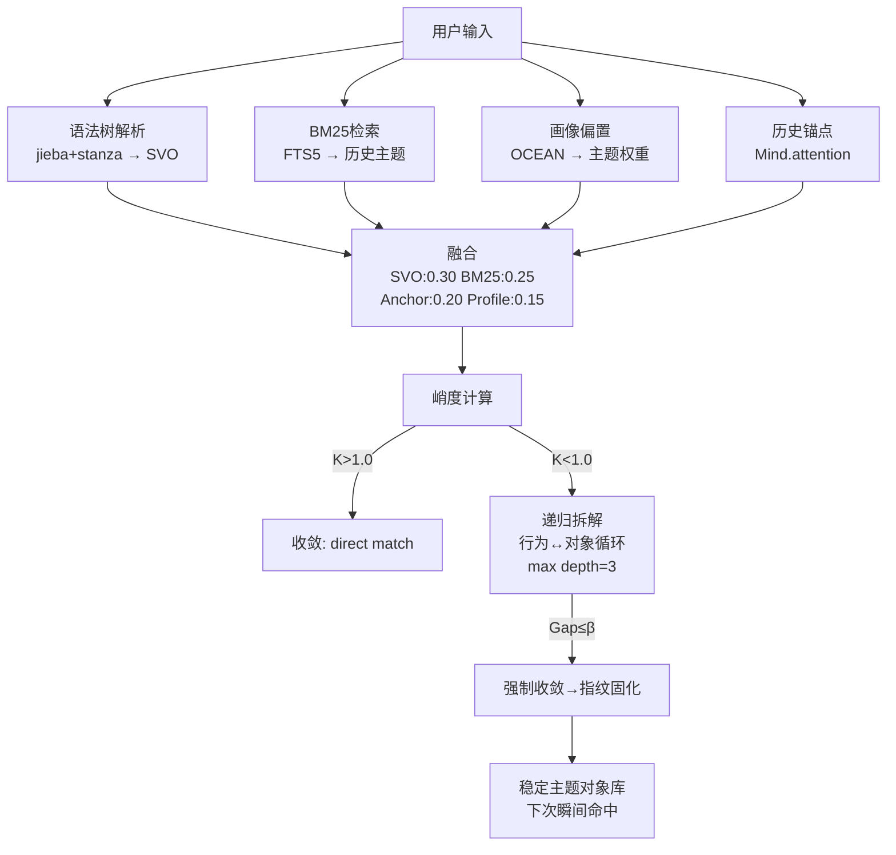

# IntentParser 递归收敛快匹配 — 替代 Tier0 正则

> 版本: v5.0 | 日期: 2026-07-21
> 
> 设计来源: BUSINESS_CHAIN_02_APPENDIX_TOPIC_MATCH.md
> 代码基: v4/tiered/fusion.py (111行, 已实现未接入)

---

## 问题

当前 Tier0 用正则子串匹配: `text含"监控" → action=explain, topic=monitoring`

```
误判: "监控"可能是 suggest_add / caution / retrospect
无法处理多义 → 同一个词在不同上下文有不同语义
无反馈 → 不可能从错误映射中学习
```

## 方案: 递归收敛快匹配



## 量化指标

| 指标 | 阈值 | 
|------|:---:|
| 熵值 H | α=0.6, H<α→收敛 |
| 峭度 K | K>1.0→直接 |
| 递归深度 | max=3 |
| NMI增益 | β=0.03 |
| 融合置信度 | γ=0.7 |

## 接入点

```python
# 替换 v3_common/intent_parser.py 的 Tier0 _classify_raw()
# → 使用 v4/tiered/fusion.py 的加权融合 + 峭度判定

# TieredIntentParser 内部:
#   Tier0 = FusionEngine (多源加权)
#   Tier1 = stanza_parser + jieba_parser (SVO)
#   Tier2 = intent_llm (LLM fallback)
```

## 需要实现

| 模块 | 文件 | 状态 |
|------|------|:---:|
| 融合引擎 | v4/tiered/fusion.py | ✅ |
| SVO提取 | v4/tiered/jieba_parser.py | ✅ |
| 依存解析 | v4/tiered/stanza_parser.py | ✅ |
| 递归拆解 | v4/tiered/syntactic_decomposer.py | ✅ |
| 峭度计算 | **缺** | ❌ |
| 指纹固化 | **缺** | ❌ |
| Tier0替换 | 需在TieredIntentParser中重新布线 | ❌ |
