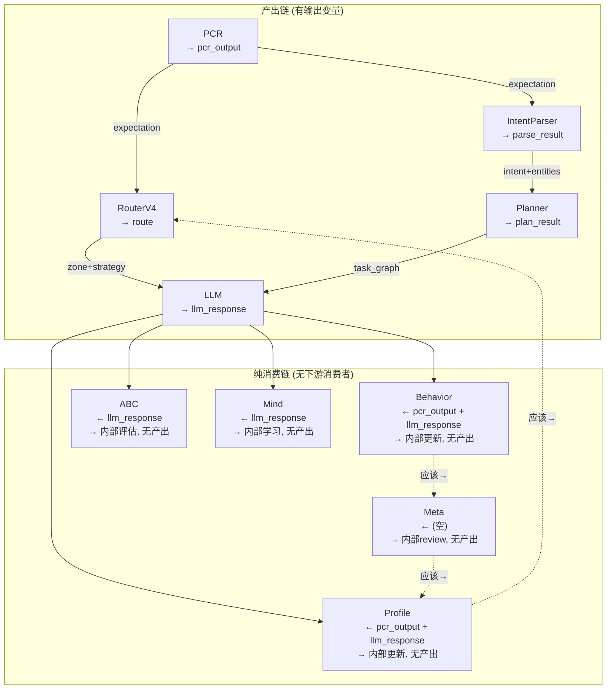

# DialogMesh v6 — 网状业务链 · 代码层依赖图

> 2026-07-22 · 基于 engine.py on_event 实际代码追踪

---

## 当前实际产出与消费



---

## 逐链分析

### 链00: PCR (Pre-Cognitive Router)

```
输入: text (用户输入)
输出: pcr_output {expectation, noise_level, complexity_level, cognitive_profile, execution_mode, prompt_style}
消费者: RouterV4, IntentParser, Planner, Context, LLM, Profile, Behavior
Decider: ✅ 已写入
```

### 链V4: RouterV4 (认知坐标路由)

```
输入: text + pcr_output
输出: route {zone, strategy, llm, cost_ms, temperature}
消费者: LLM (system_instruction注入)
Decider: ❌ 未写入
```

### 链01: IntentParser

```
输入: text + pcr_output
输出: parse_result {intent, entities, task_graph}
消费者: Planner, Context, LLM
Decider: ✅ 已写入
```

### 链1.5: Planner (规划层)

```
输入: parse_result + pcr_output
输出: plan_result {task_graph}
消费者: LLM
Decider: ❌ 未写入
```

### 链02: Context (上下文装配)

```
输入: text + pcr_output + parse_result + route + plan_result
输出: self._last_context (CrossDomainContextIR)
消费者: LLM (to_prompt)
Decider: ❌ 未写入
```

### 链LLM (回复生成)

```
输入: text + pcr_output + parse_result + plan_result + route
输出: llm_response
消费者: Profile, Behavior, ABC, Mind
Decider: ❌ 未写入
```

### 链08: Profile (认知画像)

```
输入: pcr_output + llm_response
输出: 内部 (self._cognitive_profile 更新，无下游消费者)
应当输出: profile_changed event → RouterV4 re-calibrate
Decider: ❌ 未写入
```

### 链05: Behavior (行为链)

```
输入: pcr_output + llm_response
输出: 内部 (self._behavior_discovery 更新，无下游消费者)
应当输出: pattern_discovered event → Meta review
Decider: ❌ 未写入
```

### 链09: Meta (元认知)

```
输入: (空 — 当前无输入)
输出: 内部 (self._meta.review()，无下游消费者)
应当输入: behavior pattern → review → profile drift → Profile update
Decider: ❌ 未写入
```

### 链ABC

```
输入: llm_response
输出: 内部 (self._abc.learn_from_feedback，无下游消费者)
Decider: ❌ 未写入
```

### 链Mind

```
输入: llm_response
输出: 内部 (self._mind.learn，无下游消费者)
Decider: ❌ 未写入
```

---

## 修复计划: 逐链接入 Decider

每个链修复后:
1. **产出**写入 Decider (Command + Event)
2. **消费者**从 Decider 读 State 决定是否触发
3. **条件触发**: Decider 根据 State 判断是否需要运行该链

### 接入顺序 (按依赖)

| # | 链 | 需要的前置 | 产出事件 |
|---|------|---------|------|
| 1 | RouterV4 | PCR ✅ | ROUTE_GENERATED |
| 2 | Planner | Intent ✅ | PLAN_GENERATED |
| 3 | Context | Router+Intent+Plan | CONTEXT_COMPILED |
| 4 | LLM | All above | REPLY_GENERATED |
| 5 | Profile | PCR+LLM | PROFILE_UPDATED |
| 6 | Behavior | PCR+LLM | BEHAVIOR_RECORDED |
| 7 | ABC | LLM | ABC_EVALUATED |
| 8 | Mind | LLM | MIND_LEARNED |
| 9 | Meta | Behavior+Profile | META_REVIEWED |
