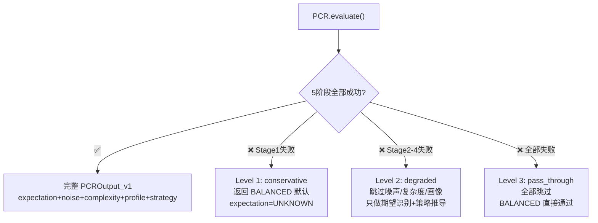

# PCR FallbackEngine — 3级降级集成规范

> 版本: v5.0 | 日期: 2026-07-21
> 
> 设计来源: design_pcr_interface_v2_1.md +
>          core/agent/pcr/fallback.py (256行, 已实现但未接入)

---

## 一、为什么需要降级



**核心原则**: PCR 失败不应阻塞整个对话。分级降级保证即使 PCR 完全挂掉，Engine 仍能正常回复。

---

## 二、降级级别

### Level 1: conservative

```
触发条件: Stage 1 (ExpectationIdentifier) 失败
行为:     返回预定义的 BALANCED 默认输出
延迟:     < 1ms
输出:
  expectation = "UNKNOWN"
  noise_assessment = None
  complexity_level = 0.5
  execution_mode = "BALANCED"
  prompt_style = "BALANCED"
```

### Level 2: degraded

```
触发条件: Stage 2-4 (NoiseSpanDetector / ComplexityEstimator / CognitiveProfiler) 失败
行为:     跳过失败阶段, 只运行 Stage 1 + Stage 5
延迟:     ~2ms
输出:
  expectation = 从 Stage 1 正常获取
  noise_assessment = None (降级为 noise_level=0)
  complexity_level = 0.5 (默认)
  cognitive_profile = None
  execution_mode = 从简化的 StrategyDeriver 获取
```

### Level 3: pass_through

```
触发条件: Stage 5 (StrategyDeriver) 失败, 或 PCR 初始化完全失败
行为:     全部跳过, 返回最小输出
延迟:     ~0ms
输出:
  所有字段 = 默认值
  expectation = "UNKNOWN"
  downstream 回退到原有的 _infer_expectation()
```

---

## 三、集成代码

### 当前 (已接, 无降级)

```python
# engine.on_event() L593-600
pcr_output = None
if self._pcr_router is not None and text:
    try:
        pcr_output = self._pcr_router.evaluate(pcr_input)
    except Exception as e:
        logger.warning("PCR evaluate failed: %s", e)
# ← 如果抛异常, pcr_output = None, 下游全部回退
```

### 目标 (接 FallbackEngine)

```python
def _evaluate_pcr(self, text: str, event) -> Optional[PCROutput_v1]:
    """PCR 评估入口 — 自动降级"""
    if self._pcr_router is None:
        return None
    
    try:
        # 完整评估
        pcr_input = PCRInput_v1(
            user_text=text,
            history=self._recent_history(),
            conversation_id=getattr(event, 'session_id', ''),
        )
        return self._pcr_router.evaluate(pcr_input)
    except Exception as e:
        logger.warning("PCR full evaluate failed: %s", e)
        
        # Level 1: conservative
        if self._pcr_lifecycle and self._pcr_lifecycle.fallback_engine:
            try:
                return self._pcr_lifecycle.fallback_engine.fallback(
                    strategy='conservative',
                    input_text=text,
                )
            except Exception as e2:
                logger.warning("PCR fallback L1 failed: %s", e2)
        
        # Level 3: pass_through — 返回 None 让 Engine 用 _infer_expectation()
        return None
```

### FallbackEngine 配置 (pcr_config.yaml)

```yaml
fallback:
  enabled: true
  
  conservative:
    enabled: true
    default_expectation: "UNKNOWN"
    default_complexity: 0.5
    default_execution_mode: "BALANCED"
    
  degraded:
    enabled: true
    skip_stages: ["noise", "complexity", "profile"]
    keep_stages: ["expectation", "strategy"]
    
  pass_through:
    enabled: true
    return_none: true  # 返回 None → Engine 用内置降级

  retry:
    max_attempts: 2
    delay_ms: 100
    backoff: exponential
```

---

## 四、Telemetry 集成

```python
# 降级事件记录 — 用于生产监控
class FallbackTelemetry:
    level1_count: int = 0       # conservative 触发次数
    level2_count: int = 0       # degraded 触发次数
    level3_count: int = 0       # pass_through 触发次数
    full_evaluate_count: int = 0  # 完整成功次数
    last_fallback_at: float = 0
    fallback_reasons: Dict[str, int] = {}  # reason → count

# 监控告警:
#   fallback_rate = (L1+L2+L3) / total > 0.1 → WARNING
#   L3_rate > 0.05 → CRITICAL
```

---

## 五、Engine 启动改进

```python
# 当前 engine._init_pcr():
def _init_pcr(self):
    try:
        from core.agent.pcr.lifecycle import PCRLifecycleManager
        self._pcr_lifecycle = PCRLifecycleManager()
        self._pcr_lifecycle.initialize()
        self._pcr_router = self._pcr_lifecycle.router
        logger.info('PCR ready: %s', self._pcr_router.name)
    except Exception as e:
        logger.warning('PCR init failed (degraded): %s', e)
        self._pcr_lifecycle = None
        self._pcr_router = None

# 改进: 增加 warm_up 超时 + health check
def _init_pcr(self):
    try:
        from core.agent.pcr.lifecycle import PCRLifecycleManager
        self._pcr_lifecycle = PCRLifecycleManager()
        self._pcr_lifecycle.initialize()
        
        # Warm up with timeout
        import threading
        warmup_ok = threading.Event()
        def do_warmup():
            try:
                self._pcr_lifecycle.warm_up()
                warmup_ok.set()
            except: pass
        t = threading.Thread(target=do_warmup)
        t.start()
        t.join(timeout=5.0)
        if not warmup_ok.is_set():
            logger.warning('PCR warmup timed out — using cold start')
        
        self._pcr_router = self._pcr_lifecycle.router
        
        # Background health check
        self._pcr_lifecycle.start_health_check(interval_sec=30)
        logger.info('PCR ready: %s', self._pcr_router.name)
    except Exception as e:
        logger.warning('PCR init failed (degraded — engine will use _infer_expectation): %s', e)
        self._pcr_lifecycle = None
        self._pcr_router = None
```

---

## 六、Engine 关闭改进

```python
# 当前: engine.stop() 没有 shutdown PCR
# 改进:
def stop(self):
    # ... existing stop logic ...
    
    # PCR lifecycle shutdown
    if hasattr(self, '_pcr_lifecycle') and self._pcr_lifecycle:
        try:
            self._pcr_lifecycle.shutdown()
            logger.info('PCR shutdown complete')
        except Exception as e:
            logger.warning('PCR shutdown error: %s', e)
```
