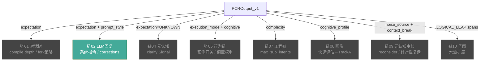

# PCR → 下游链 信号接口规范

> 版本: v5.0 | 日期: 2026-07-21
> 
> 定义 PCROutput_v1 中每个字段如何流向 10 条业务链。
> 当前状态: ✅ 链02 已接, ❌ 其余 7 条待接。

---

## 一、信号总表



---

## 二、链 02: LLM 回复 (✅ 已接)

### 当前实现

```python
# engine._call_llm(event, pcr_output)
if pcr_output:
    if pcr_output.expectation == 'TOOL':
        system_instruction += " [PCR: TOOL mode — direct response]"
    elif pcr_output.expectation == 'COMPANION':
        system_instruction += " [PCR: COMPANION mode — conversational]"
    if getattr(pcr_output, 'prompt_style', '') == 'BRIEF':
        system_instruction += " [PCR: BRIEF — one paragraph]"
```

### 待补: NoiseSpan 逐条处理

```python
if pcr_output and pcr_output.noise_assessment:
    corrections = []
    for span in pcr_output.noise_assessment.spans:
        if span.noise_type == NoiseType.TYPO and span.suggested_correction:
            corrections.append({
                "position": (span.start_char, span.end_char),
                "original": user_text[span.start_char:span.end_char],
                "correction": span.suggested_correction,
            })
        elif span.noise_type == NoiseType.PROMPT_INJECTION_SUSPECT:
            # XML 转义隔离
            user_text = (user_text[:span.start_char] + 
                        f"<ignore>{user_text[span.start_char:span.end_char]}</ignore>" +
                        user_text[span.end_char:])
        elif span.noise_type == NoiseType.UNRELATED_FLUFF:
            # 剪枝: 从 user_text 中移除该 span
            user_text = user_text[:span.start_char] + user_text[span.end_char:]
    
    if corrections:
        system_instruction += f"\n[PCR] Input corrections: {json.dumps(corrections)}"
```

---

## 三、链 01: 对话树 (❌ 待接)

### 信号映射

```python
# engine._compile_context(event, pcr_output)

def _apply_pcr_to_context(self, pcr_output):
    """PCR → Context Compilation 策略调控"""
    if pcr_output is None:
        return  # 降级: 使用默认策略
    
    # expectation → compile mode
    if pcr_output.expectation == 'TOOL':
        self._compile_mode = 'fast'       # skip DomainSelector, depth=1
        self._domain_boosts = {}           # 不做领域匹配
    elif pcr_output.expectation == 'DEEP_RESEARCH':
        self._compile_mode = 'deep'
        self._subgraph_expand = True      # 水波扩展全部域
    elif pcr_output.expectation == 'COMPANION':
        self._compile_mode = 'conversational'
    
    # complexity → Fast Path 门控
    if getattr(pcr_output, 'complexity_level', 0) < 0.2:
        self._fast_path_enabled = True    # 跳过 IntentParser Stage 6-8
    
    # AMBIGUOUS_ANAPHORA → 强制 CLARIFICATION
    if pcr_output.noise_assessment:
        for span in pcr_output.noise_assessment.spans:
            if span.noise_type == NoiseType.AMBIGUOUS_ANAPHORA:
                self._force_clarification = True
                self._clarification_candidates = self._get_history_candidates()
                break
```

### 影响路径

```
expectation=TOOL    → 跳过 DomainSelector → 直接 fast context → 减少 ~50ms
expectation=RESEARCH → SubgraphCompiler 全展开 → 更多 context → 更准确回复
AMBIGUOUS_ANAPHORA  → 强制 CLARIFICATION → 不 fork 新分支 → 等待用户澄清
```

---

## 四、链 05: 行为链 (❌ 待接)

### 信号映射

```python
# engine._update_behavior(event, pcr_output) — 待创建

def _update_behavior_from_pcr(self, pcr_output):
    if pcr_output is None:
        return
    
    # execution_mode → 预测开关
    if pcr_output.execution_mode == 'FAST_EXECUTE':
        self._behavior_predictor.enabled = False  # 工具模式不需要预测
    else:
        self._behavior_predictor.enabled = True
    
    # cognitive_profile → 偏置权重
    profile = pcr_output.cognitive_profile
    if profile:
        # OCEAN → topic 匹配权重调整
        self._behavior_predictor.set_profile_bias({
            'CS': profile.communication_style,        # 沟通风格→结构偏好
            'NC': profile.need_for_cognition,          # 认知需求→深度偏好
            'DK': profile.domain_knowledge,            # 领域知识→主题权重
        })
```

---

## 五、链 08: 画像 (❌ 待接)

### 信号映射

```python
# engine._update_profile(event, pcr_output) — 待创建

def _update_profile_from_pcr(self, pcr_output):
    """PCR 快速评估结果注入 TrackA"""
    if pcr_output is None or pcr_output.cognitive_profile is None:
        return
    
    fast = pcr_output.cognitive_profile
    # EMA 混合: 快速评估 × 0.3 + 慢速TrackA × 0.7
    alpha = 0.3
    if self._cognitive_profile:
        self._cognitive_profile.track_a.cog_resource = (
            alpha * fast.cognitive_level + 
            (1-alpha) * self._cognitive_profile.track_a.cog_resource
        )
        self._cognitive_profile.track_a.attention_anchor = (
            alpha * fast.attention_level + 
            (1-alpha) * self._cognitive_profile.track_a.attention_anchor
        )
```

---

## 六、链 09: 元认知审核 (❌ 待接)

### 信号映射

```python
# engine._trigger_meta_review(event, pcr_output) — 待创建

def _trigger_meta_review_from_pcr(self, pcr_output):
    if pcr_output is None:
        return
    
    signals = []
    
    # UNKNOWN expectation → clarify
    if pcr_output.expectation == 'UNKNOWN':
        signals.append(MetaSignal(type='CLARIFY_NEEDED', 
                     reason='PCR无法识别用户期望'))
    
    # Context break → audit
    if (pcr_output.noise_assessment and 
        pcr_output.noise_assessment.noise_source == 'context_break'):
        signals.append(MetaSignal(type='CONTEXT_BREAK_DETECTED',
                     detail=pcr_output.noise_assessment))
    
    # 噪声异常 → reconsider
    if getattr(pcr_output, 'noise_level', 0) > 0.7:
        signals.append(MetaSignal(type='HIGH_NOISE', 
                     level=pcr_output.noise_level))
    
    for sig in signals:
        self._meta_queue.push(sig)
```

---

## 七、链 10: 子图 (❌ 待接)

### 信号映射

```python
# engine._expand_subgraph(event, pcr_output) — 待创建

def _expand_subgraph_from_pcr(self, pcr_output):
    if pcr_output is None:
        return
    
    triggers = []
    
    # DEEP_RESEARCH mode → 全展开
    if pcr_output.execution_mode == 'DEEP_RESEARCH':
        triggers.append(('all', 0.9))
    
    # LOGICAL_LEAP spans → 针对性展开
    if pcr_output.noise_assessment:
        for span in pcr_output.noise_assessment.spans:
            if span.noise_type == NoiseType.LOGICAL_LEAP:
                gap_domain = self._infer_gap_domain(span)
                triggers.append((gap_domain, span.severity))
    
    for domain, priority in triggers:
        self._subgraph_compiler.expand(
            domain=domain,
            priority=priority,
            source='pcr',
        )
```

---

## 八、接入状态

| 链 | 信号 | 代码位置 | 状态 |
|---|------|---------|:---:|
| 02 | expectation + prompt_style | `_call_llm()` L2210 | ✅ |
| 01 | expectation→compile depth | `_compile_context()` | ❌ |
| 01 | AMBIGUOUS→CLARIFICATION | 同上 | ❌ |
| 05 | execution_mode→预测开关 | 待创建 `_update_behavior()` | ❌ |
| 05 | cognitive→偏置权重 | 同上 | ❌ |
| 07 | complexity→max_sub_intents | `_compile_context()` | ❌ |
| 08 | cognitive→TrackA注入 | 待创建 `_update_profile()` | ❌ |
| 09 | UNKNOWN/noise→meta信号 | 待创建 `_trigger_meta_review()` | ❌ |
| 10 | LOGICAL_LEAP→水波 | 待创建 `_expand_subgraph()` | ❌ |
