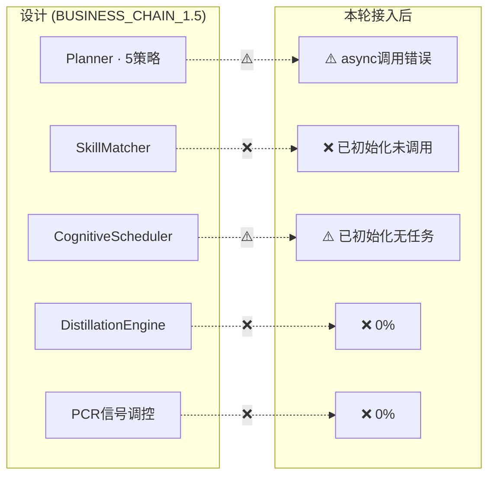

# Planning Layer — 接入后差距审计

> 2026-07-21 · 本轮: Planner 已接入 on_event

---

## 差距总览



---

## 详细问题

### 1. Planner async 调用错误 ⚠️

```
Plan 接口:  async def plan(self, ...)
当前调用:  plan_result = self._planner.plan(intent=...)  # 同步调用
结果:      返回 coroutine 对象, 不是 PlanResult
          → plan_result.task_graph 永远是 None
          → 没有任何 TaskGraph 节点注入 LLM
```

**根因**: `on_event` 是同步函数, 不能 `await`。`plan()` 需要 `run_in_executor` 包装。

### 2. SkillMatcher 闲置 ❌

```
SkillMatcher 已初始化: ✅
被调用:              ❌ on_event 中没有任何 match() 调用
实现:                v3_0/planning/skill_matcher.py match(intent: str, context)
接口问题:            match() 接受 str, 我们的 parse_result.intent 是对象

需要: on_event 中调用 skill_matcher.match(str(parse_result.intent))
      → 得到 Capability Blueprint
      → 传给 Planner.plan()
```

### 3. CognitiveScheduler 无任务 ⚠️

```
已初始化: ✅ L447 PathAwareScheduler
接收任务: ❌ planner 输出的 TaskGraph 从未传给 scheduler
调度执行: ❌

需要: scheduler.submit(plan_result.task_graph)
```

### 4. PCR 信号未流入 ❌

```
设计中: expectation → 策略选择
        cognitive_profile → skill偏置
        complexity → 递归深度

当前:   Planner.plan() 的 intent_context 为空
        → 永远使用默认 BALANCED 策略
```

### 5. DistillationEngine 0% ❌

```
代码: v4/skill_layer/distillation_engine.py (198行)
功能: 运行记录 → Pattern → Skill
触发: 从未在 on_event 或 checkpoint 中调用
```

### 6. SkillRegistry 空 ❌

```
已实现: v3_0/planning/skill_registry.py
已加载: 0 个 Capability Blueprint
需要:   启动时从 blueprints.py (207行) 加载预定义模板
```

### 7. ToolShortlister 未接 ❌

```
设计: DESIGN_TASK_PLANNING_DYNAMIC §2.1
功能: intent → 从工具池筛选相关子集 → 注入 LLM
当前: 0%
```

---

## 修复清单

| # | 问题 | 修复方式 | 工作 |
|---|------|---------|:---:|
| 1 | async plan() | `run_in_executor` 包装 | 5行 |
| 2 | SkillMatcher 未调 | on_event 加 match() | 5行 |
| 3 | Scheduler 无任务 | plan_result → scheduler.submit() | 3行 |
| 4 | PCR 信号未流入 | plan_ctx.expectation/strategy | 8行 |
| 5 | DistillationEngine | checkpoint 中调用 | 10行 |
| 6 | SkillRegistry 空 | 启动时 load blueprints | 5行 |
| 7 | ToolShortlister | intent→工具筛选 | 20行 |

**总工作量: ~56 行**

---

## 有效实现率

```
Planner 代码:       100%
接入 on_event:      10% (调用了但 async 错误)
有效实现率:         ~2%
```
